# **Description**
*Boruci Skok* is a platform game in which the player's main task is to get to the top using only jumping.

## **Controls**
In terms of movement, the player can use three buttons during the game - left arrow, right arrow and space bar. Therefore, all movement in the game is done by jumping, the strength of which can be controlled by the time the space bar is pressed.

## **Gameplay**
### *Multiplayer*
In the above game I used [Photon](https://www.photonengine.com/pun) technology to support multiplayer. Unfortunately, due to certain restrictions, only 20 people at a time can play in *Boruci Skok*.
### *Singleplayer*
Despite the fact that the idea of the game was focused on team play, in *Boruci Skok* you can play in SinglePlayer mode - unfortunately due to some mechanics, some characters are not available in this mode.
### *Characters*
There are 7 characters available in *Boruci Skok*, 2 of which are unavailable in singleplayer mode.

- 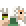
**Platformer** 
Platformer is able to erect new platforms that can be used by other players. The only condition is that the newly created platform must not overlap with other platforms.
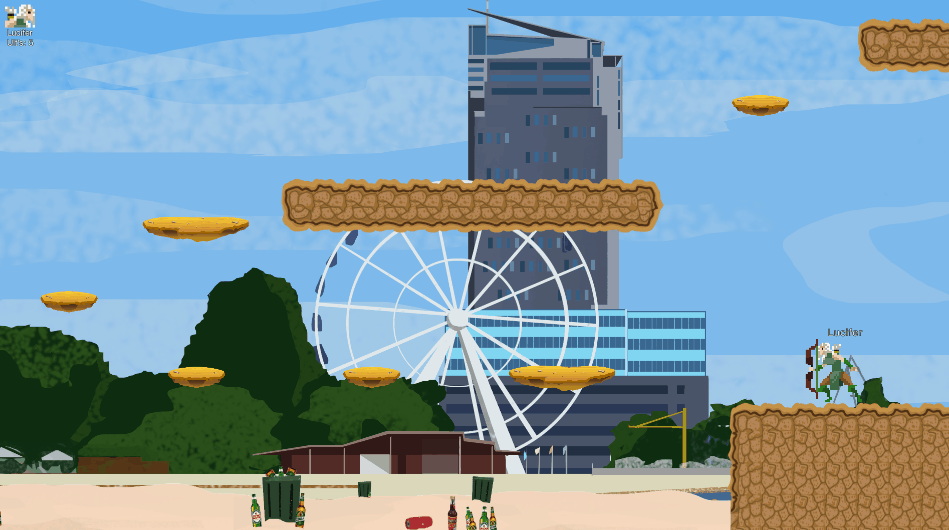

- 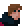
**Destroyer** 
Destroyer can destroy platforms (including those created by players). Exceptions are the solid elements of the environment, such as level walls, or the starting ground.
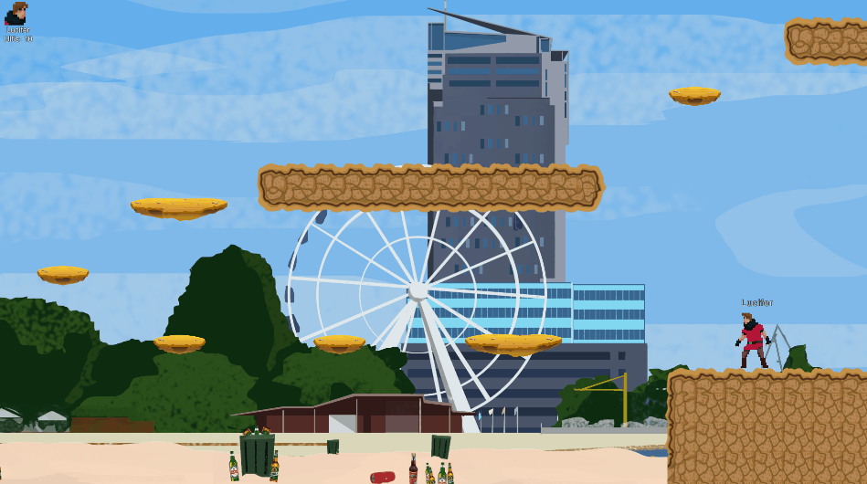

- 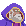
**Teleporter** 
Teleporter can teleport a selected player he sees on the screen to himself. Unavailable in Multiplayer mode.
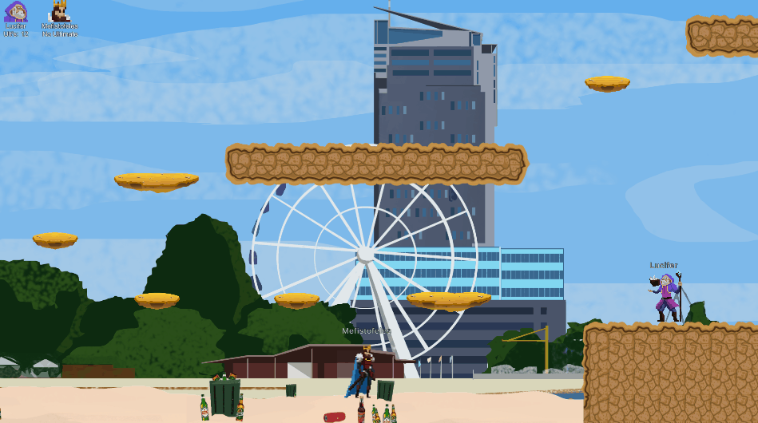

- 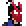
**Time Leaper** 
Time Leaper can go back to the position he was 3 seconds ago.
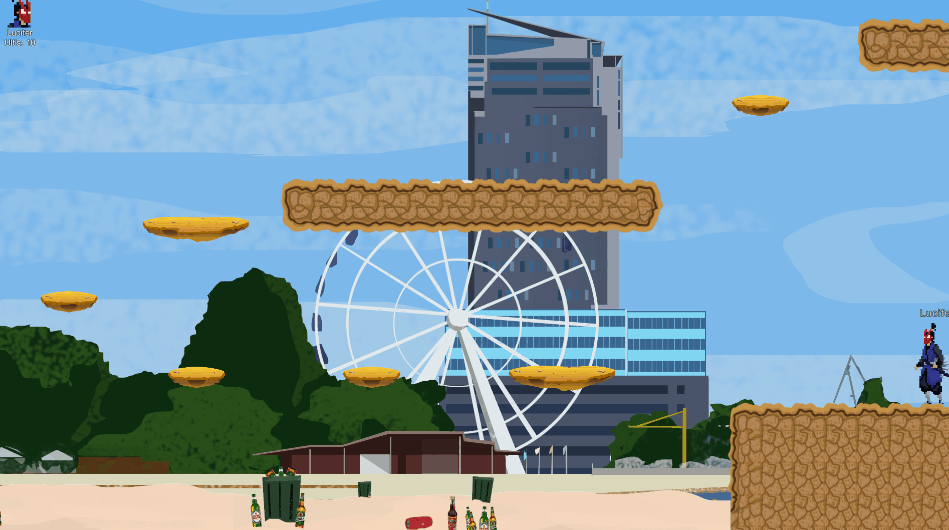

- 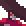
**Wind Master** 
Wind Master increases his jump strength by 30% for 10 seconds.  
Passive Skill: Wind has no effect on him.
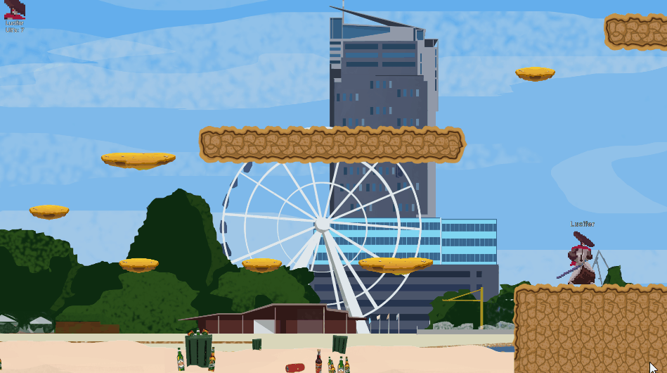

- 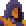
**Swaper** 
Swaper can swap places with a selected player he sees on the screen. Unavailable in Multiplayer mode.
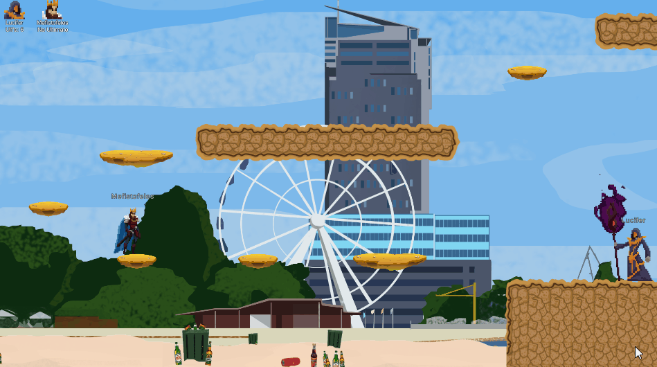

- 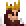
**Jump King** 
Jump King has no special abilities.  
Passive Skill: Jump King can see his jump charge bar.
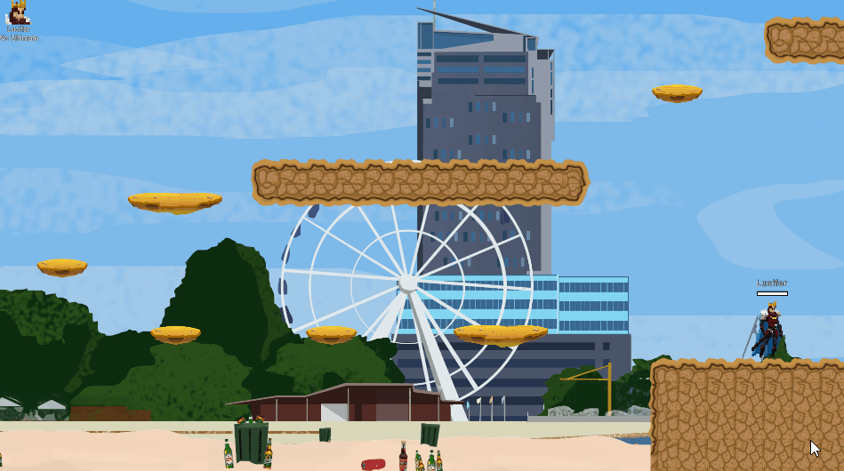

### *Spectator Mode*
It is possible to enable spectator mode in the game, thanks to which the player is able to watch his companions during the game. In addition, Spectate mode turns on automatically when you reach the end of the game.

## *Graphic Attribution*
- Gdynia's Beach Background - Bartek Rutkowski
- Forest Background- Bartek Rutkowski
- Mountain Waterfall Background- Bartek Rutkowski
- Snow-covered Mountains Background- Bartek Rutkowski
- Lighthouse Background- Bartek Rutkowski
- Iceberg Background- Bartek Rutkowski
- Post Apocalyptic Parallax Backgrounds - Craftpix.net
- Horizontal 2D Parallax Backgrounds - Craftpix.net
- "Free Desert Platformer Tileset" - pzUH from [Open Game Art](https://opengameart.org/content/free-desert-platformer-tileset)
- "Beer" - Mapachana from [Open Game Art](https://opengameart.org/content/beer)
- "Warped City" - Luis Zuno @ansimuz
- "Postapo 2D pixel art tileset" - [Pat](gamebaker.itch.io)
- "Glow Arrow" - oglsdl from [Open Game Art](https://opengameart.org/content/glow-arrow)